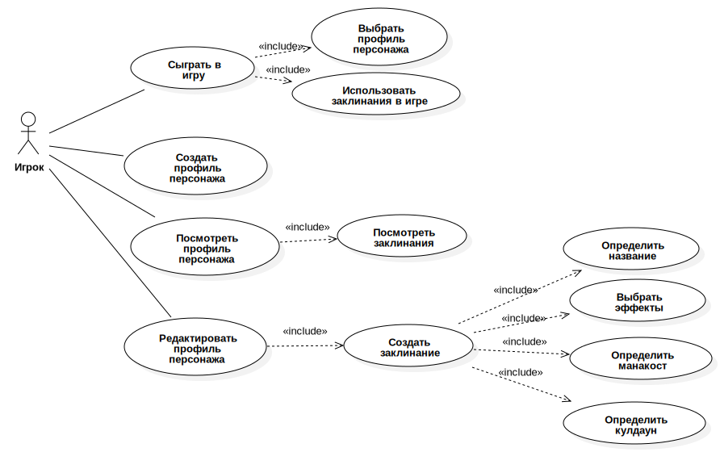
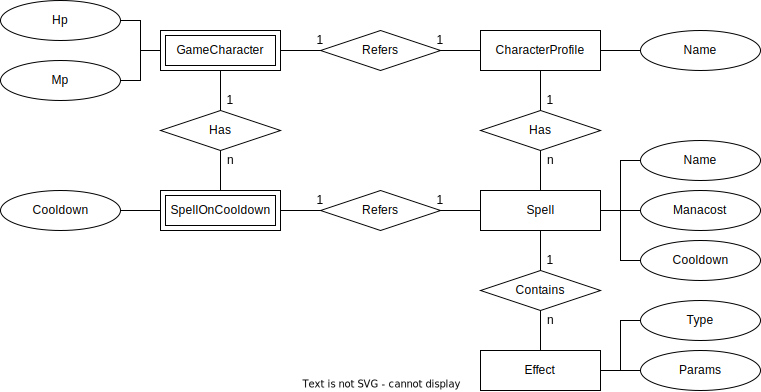

# Лабораторные работы по ППО Муравьев Илья ИУ7-65Б

## Название и описание проекта
Проект **"Spell Warfare"**. Это [пошаговая стратегия](https://ru.wikipedia.org/wiki/%D0%9F%D0%BE%D1%88%D0%B0%D0%B3%D0%BE%D0%B2%D0%B0%D1%8F_%D1%81%D1%82%D1%80%D0%B0%D1%82%D0%B5%D0%B3%D0%B8%D1%8F)
для двоих. У каждого игрока есть:
- Запас здоровья
- Заклинания
- Запас маны

## Правила игры
В игре есть два понятия, касающиеся времени: ход и раунд.

**Ход (1 ход)** - это промежуток времени, в который один из игроков использует заклинания.

**Раунд (1 раунд)** - это промежуток времени, в который все игроки сделали 1 ход.
То есть для 2 игроков это 2 хода - 1 ход первого игрока и 1 ход второго игрока.

> Первым считается игрок, делающих первый ход в игре

Цель игры - понизить здоровье противника до 0. Этого можно достичь используя заклинания.
Каждое заклинание имеет стоимость в единицах маны (манакост), эффекты (набор эффектов) - результат его использования
и кулдаун (время, которое должно пройти перед повторным использованием этого заклинания). Кулдаун измеряется в раундах.
Каждый раунд кулдаун всех заклинаний всех игроков уменьшается на 1.

За свой ход игрок может использовать любое количество заклинаний. Условия использования заклинания в свой ход:
1. У игрока достаточно маны для использования заклинания
2. Заклинание не в кулдауне (то есть кулдаун = 0 раундов)

## Особенности игры
В **Spell Warfare** игроки сами создают заклинания.
В игре нет предопределенных заклинаний, но есть предопределенные эффекты.
Каждый эффект имеет **цель** (одного из игроков) и **действие**, направленное на этого игрока.

Предопределенные эффекты:
1. Увеличить запас здоровья цели на N единиц
2. Уменьшить запас здоровья цели на N единиц 
3. Увеличить запас маны цели на N единиц 
4. Уменьшить запас маны цели на N единиц

N - это число, которое игрок, создающий заклинание, определяет сам.

**Заклинание** - это набор эффектов по ходам.
Поэтому оно может быть "длинным", в том смысле что его эффекты не ограничиваются одним ходом.
Например, можно создать заклинание, которое "поджигает", в результате цель горит несколько ходов.

Эффекты заклинания начинают работать со следующего хода.
То есть после применения заклинания первый его эффект подействует только на следующем ходе.

**Последовательность применения эффектов заклинаний** определяется по принципу очереди: последний примененный эффект подействует последним (а первый - первым). 

## Похожие игры

| Игра                                                             | Пошаговая | Для двоих | Можно создавать заклинания |
|------------------------------------------------------------------|-----------|-----------|----------------------------|
| [Hearthstone](https://playhearthstone.com)                       | ✅         | ✅         | ❌                          |
| [Magic: The Gathering Online](https://magic.wizards.com/en/mtgo) | ✅         | ✅         | ❌                          |
| [Magicka](https://store.steampowered.com/app/42910/Magicka/)     | ✅         | ✅         | ✅                          |

## Целезобразность и актуальность
Проект является актуальным как минимум для меня и моего брата:
уже несколько лет у нас есть мечта превратить свою настольную игру с созданием заклинаний в компьютерную.
Тогда можно делать анимации для заклинаний, которые будет намного эффектнее цветных рисунков на бумаге.

**Spell Warfare** в идейном плане является фреймворком для создания простых пошаговых стратегий,
связанных с использованием заклинаний. Его ближайший аналог - игра Magicka не дает такой же свободы,
поскольку уже определяет баланс заклинаний в игре (это неплохо, но ограничивает пути развития). Поэтому **Spell Warfare**,
хоть и с некоторыми допущениями, можно назвать "первой в своем роде". 

## UseCase диаграмма

## ER диаграмма

## Архитектурные характеристики
Важными для проекта архитектурными характеристиками являются:
- Возможность добавления новых механик заклинаний без значительных изменений базиса (дает возможности для развития)
- Кроссплатформенность (обеспечивает доступность)

## Тип приложения
Web SPA. Потому что:
- Кросплатформенность с единой кодовой базой
- Легко разрабатывать красивый UI
